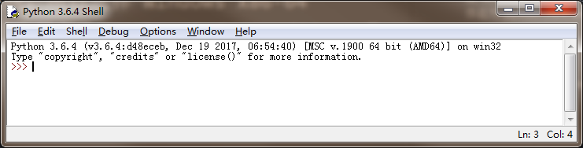

### 下载python安装包
1. 访问地址：https://www.python.org/downloads/
2. 选择windows系统进入下载页面
3. 现在用户一般使用的是window-x64的的操作系统，所以选择“Windows x86-64 executable installer”进行下载，下载完成后的文件名为“python-3.6.4-amd64.exe”

### 安装python
1. 点击“python-3.6.4-amd64.exe”进行安装

### 安装环境变量
1. 添加python的安装目录到path中
` PATH=PATH;D:\soft\Python\Python36;D:\soft\Python\Python36\Scripts;`
2. 进入cmd窗口，输入python命令，会输出如下信息：
```
C:\Users\LS>python
Python 3.6.4 (v3.6.4:d48eceb, Dec 19 2017, 06:54:40) [MSC v.1900 64 bit (AMD64)] on win32
Type "help", "copyright", "credits" or "license" for more information.
>>>exit()
```

### python编辑器
1. 打开python自带的编辑器“IDLE”

2. 至此就可以进行python开发了
3. 在">>>"提示符下只能执行单行语句
4. 选择"file>new file"打开一个新的文件，就可以进行多行语句开发.写完语句后选择"Run>Run Module"执行语句
