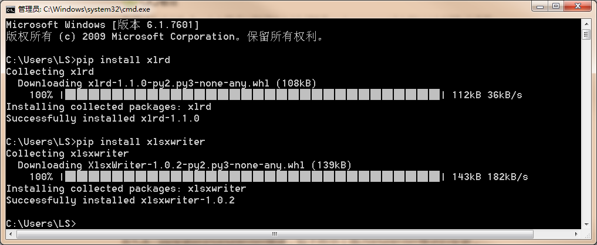

## 面向对象编程
---
### 类
```
创建类
class 类名:
  类里面的内容

实例化类
clz=类名()
```

### 构造函数
```
构造函数语法：
__init__(self,参数)
self必须是构造函数的第一个参数，类中方法必须带上self参数
```
```
class Cls2:
  def __init__(self):
    print("I am cls2 self!")

cz=Cls2()

------------------------
class Cls2:
    def __init__(self,name,age):
        print("myname is " + name +",age is " + str(age))

cz=Cls2("mike",24)
```

### 属性
```
class Cls2:
    def __init__(self,name,age):
        self.myname=name
        self.age=age

cz=Cls2("mike",24)
print("myname is " + cz.myname +",age is " + str(cz.age))
```
### 方法
```
class Cls2:
    def __init__(self,name):
        self.myname=name

    def myfunc1(self,name):
        print("hello," + name)

    def myfunc2(self):
        print("hello," + self.myname)


cz=Cls2("jackson")
cz.myfunc1("mike")
cz.myfunc2()
```

### 继承与重载
- 继承：把一个或多个类（基类）的特性继承过来
- 重载：在子类（派生类）里面对继承过来的特性重新定义
- 父类：基类
- 子类：派生类

```
class father():
    def speak(self):
        print("I can speak!")

class mother():
    def write(self):
        print("I can write!")

class son(father):  #单继承
    pass #没有自己方法，就直接pass,不能少，否则报语法错误

class daughter(father,mother):  #多继承
    def speak(self):
        print("I can speak faster!") #重载

    def listen(self):
        print("I can listen")

s=son()
s.speak()

d=daughter()
d.speak()
d.write()
d.listen()
```

### 实战案例
```
#将多Excel，多sheet里面的内容合并到一个Excel文件中
#要点：使用第三方模块，比如xlrd、xlwt
#参考网址：
https://post.mp.qq.com/group/show/32353037323338343937-16428234.html?_wv=2147483777&v=3&sig=34d3b8e5ddf31c984a10dc3dc20b7928&_bid=2321&article_id=16428234&time=1483797600&uin=270184675&puin=2507238497&web_ch_id=0&s_id=4guztv_9s43u&share_source=0

```

1. pip安装xlrd与xlsxwriter模块

自动被安装到“Lib/site-packages”目录下

2. 准备文件

  **准备1.xlsx文件**


    课程列表sheet页
| 课程名 | 讲师    | 发布日期   |
| ----- |:-------:| -----     |
| PHP   | mike    | 2017.12.1 |
| Linux | jackson | 2017.12.1 |

    书籍列表sheet页

  | 书籍名	| 出版社	| 出版日期 |
  | ----- | ------ | ------- |
  | PHP	| 电子	| 2017.12.1 |
  | Linux	| 机械工业	| 2017.12.1 |


  **准备2.xlsx文件**


    课程列表sheet页
  | 课程名 | 讲师    | 发布日期   |
  | ----- |:-------:| -----     |
  | PHP   | mike    | 2017.12.2 |
  | Linux | jackson | 2017.12.2 |

    书籍列表sheet页

  | 书籍名	| 出版社	| 出版日期 |
  | ----- | ------ | ------- |
  | PHP	| 电子	| 2017.12.2 |
  | Linux	| 机械工业	| 2017.12.2 |


  **准备3.xlsx文件**


    课程列表sheet页
| 课程名 | 讲师    | 发布日期   |
| ----- |:-------:| -----     |
| PHP   | mike    | 2017.12.3 |
| Linux | jackson | 2017.12.3 |

    书籍列表sheet页

  | 书籍名	| 出版社	| 出版日期 |
  | ----- | ------ | ------- |
  | PHP	| 电子	| 2017.12.3 |
  | Linux	| 机械工业	| 2017.12.3 |


3. 合并excel程序

```
import xlrd,xlsxwriter  
#设置要合并的所有文件
allxls=["C:/Users/LS/Desktop/1.xlsx","C:/Users/LS/Desktop/2.xlsx","C:/Users/LS/Desktop/3.xlsx"]

#设置合并到的文件
endxls ="C:/Users/LS/Desktop/endxls.xlsx"

#打开表格
def open_xls(file):
    try:
        fh=xlrd.open_workbook(file)
        return fh
    except Exception as e:
        print(str("打开文件出错，错误为：" + e))

#获取所有sheet
def getAllSheet(fh):
    return fh.sheets()

#读取某个sheet的行数
def getnrows(fh,sheet):
    table=fh.sheets()[sheet]
    rownum=table.nrows
    return rownum

#读取某个文件的内容并返回所有行的值
def getfilect(file,shnum):
    fh=open_xls(file)     
    table=fh.sheet_by_name(shname[shnum])
    rownum=getnrows(fh,shnum)
    lenrvalue=len(rvalue)
    for row in range(0,rownum):
        rdata=table.row_values(row)
        rvalue.append(rdata)
    filevalue.append(rvalue[lenrvalue:])
    return filevalue

#存储各sheet名
shname=[]
#存储一行结果
rvalue=[]
#存储一个标签的结果
svalue=[]
#存储所有读取的结果
filevalue=[]


#读取第一个待读文件，获得sheet数
fh=open_xls(allxls[0])
sh=getAllSheet(fh)
x=0
for sheet in sh:
    shname.append(sheet.name)
    svalue.append([])
    x+=1

#依次读取各sheet的内容
#依次读取各文件当前sheet的内容
for shnum in range(0,x):
    for fl in allxls:
        print("正在读取文件："+str(fl)+"的第"+str(shnum)+"个标签的…")
        filevalue=getfilect(fl,shnum)

#打开最终写入的文件
wb1=xlsxwriter.Workbook(endxls)
#创建一个sheet工作对象
ws=wb1.add_worksheet()

linenum=0

for s in range(0,len(filevalue)):
    #将一个标签的内容写入新文件中
    sheetData=filevalue[s]
    for a in range(0,len(sheetData)):
        sheetRow=sheetData[a]
        for b in range(0,len(sheetRow)):
            column=sheetRow[b]
            ws.write(linenum,b,column)
        linenum+=1  

wb1.close()
```


4. 生成合并的excel文件信息

  ** endxls.xlsx文件 **


  | 课程名 | 讲师 | 发布日期 |
  | --- | -- | -- |
  | PHP | mike | 2017.12.1 |
  | Linux | jackson | 2017.12.1 |
  | 课程名 | 讲师 | 发布日期 |
  | PHP | mike | 2017.12.2 |
  | Linux | jackson | 2017.12.2 |
  | 课程名 | 讲师 | 发布日期 |
  | PHP | mike | 2017.12.3 |
  | Linux | jackson | 2017.12.3 |
  | 书籍名 | 出版社 | 出版日期 |
  | PHP | 电子 | 2017.12.1 |
  | Linux | 机械工业 | 2017.12.1 |
  | 书籍名 | 出版社 | 出版日期 |
  | PHP | 电子 | 2017.12.2 |
  | Linux | 机械工业 | 2017.12.2 |
  | 书籍名 | 出版社 | 出版日期 |
  | PHP | 电子 | 2017.12.3 |
  | Linux | 机械工业 | 2017.12.3 |
