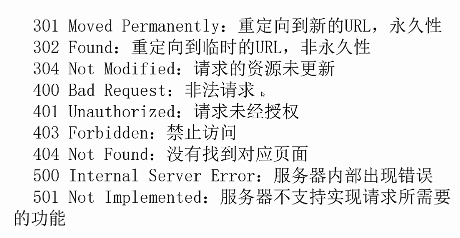

## 网络爬虫之浏览器伪装
---
### Urllib基础
> 学习urlretrieve()、urlcleanup()、info()、getcode()、geturl()等

```
import urllib.request
import re

#urlretrieve(网址,本地存储地址) 直接下载网页到本地
urllib.request.urlretrieve("http://www.baidu.com","C:/Users/LS/Desktop/download.html")

#urlcleanup()清除缓存
urllib.request.urlcleanup()

#info()查看网页相关简介信息
file=urllib.request.urlopen("https://read.douban.com/provider/all")
print(file.info())

#getcode() 返回网页响应码，用来判断网页是否存在
print("code:" + str(file.getcode()))

#geturl() 获取当前访问网页的url
print(file.geturl())
```

### 超时设置
> 由于网络速度或对方服务器的问题，在爬取网页的时候，都需要时间。如果该网页长时间未响应，那么我们的系统就会判断该网页超时了，即无法打开该网页。

```
#超时设置,如果超时就会报错，所以需要捕获异常
import urllib.request
for i in range(0,100):
    try:
        file=urllib.request.urlopen("http://yum.iqianyue.com",timeout=1)
        file.read().decode("utf-8")
    except Exception as err:
        print("出现异常：" + str(err))
```

### 自动模拟HTTP请求(GET/POST)
```
#get请求-实现百度信息自动搜索,提取标题
import urllib.request
import re
keywd="王者荣耀"
keywd=urllib.request.quote(keywd) #中文需要编码

for i in (1,11):
    requrl="http://www.baidu.com/s?wd=" + keywd + "&pn=" + str((i-1)*10) #不能通过https访问，分页
    data=urllib.request.urlopen(requrl).read().decode("utf-8")
    #data-tools="{title:'Python_百度百科',url:'http://baike.baidu.com/item/Python/407313?fr=aladdin'}">
    pat='<a .*?>(<em>.*?</em>.*?)</a>'
    rst=re.compile(pat).findall(data)
    print(rst)
    print("--------------------------------------------------------------------")
```
```
#post请求
import urllib.request
import urllib.parse

posturl="http://www.iqianyue.com/mypost"
params=urllib.parse.urlencode({
    'name':'test',
    'pass':'123'
}).encode("utf-8")

req=urllib.request.Request(posturl,params)
data=urllib.request.urlopen(req).read().decode("utf-8")
print(data)
```

### 异常处理
> 爬虫在运行过程中，经常遇到异常，如果没有异常处理，爬虫遇到异常就会自动退出

1. 状态码


2. URLError和HTTPError

 两者都是异常处理的列，HTTPErorr是URLError的子类，HTTPError有异常状态码和异常原因，URLError没有异常状态码，所以在处理的时候，不能使用URLError直接代替HTTPError。如果要代替，必须判断是否有状态码属性。

 ```
 '''
URLError出现的原因：
1）连不上服务器
2）远程url不存在
3）无网络
4）触发HTTPError
'''
import urllib.request
import urllib.error
try:
    urllib.request.urlopen("http://blog.csdn.net/abc")
except urllib.error.URLError as e:
    if hasattr(e,"code"):
        print("code=" + str(e.code))
    elif hasattr(e,"reason"):
        print("reason=" +e.reason)
    else:
        print(e)
 ```

### 浏览器伪装技术
> 我们爬取csdn博客时，csdn会返回403，因为对方服务器会对爬虫进行屏蔽。此时，我们需要伪装成浏览器才能爬取。浏览器伪装我们一般通过报头进行

1. 由于urlopen对一些http的高级功能不支持。我们如果要修改http请求头，可以使用urllib.request.build_opener()进行，或者使用urllib.request.Request下的add_header()来实现

```
# 伪装浏览器
import urllib.request
import urllib.error
try:
    url="http://blog.csdn.net"
    #头文件格式header("User-Agent",具体用户代理值)
    headers=("User-Agent","Mozilla/5.0 (Windows NT 6.1; WOW64) AppleWebKit/537.36 (KHTML, like Gecko) Chrome/63.0.3239.132 Safari/537.36")
    opener = urllib.request.build_opener()
    opener.addheaders=[headers]
    data=opener.open(url).read()
    fh=open("C:/Users/LS/Desktop/blog.html","wb")
    fh.write(data)
    fh.close()
except urllib.error.URLError as e:
    if hasattr(e,"code"):
        print("code=" + str(e.code))
    elif hasattr(e,"reason"):
        print("reason=" +e.reason)
    else:
        print(e)

#1.如何将opener安装为全局，让urlopen()访问时也添加对应报文头？
#2.研究使用Request方式进行报头添加
```

### 新闻爬虫实战
1. 需求：将腾讯新闻首页所有新闻都爬到本地
2. 思路：先爬首页，通过正则获取所有新闻链接，然后依次爬各种新闻，并存储到本地
3. 实战代码

```
#爬取腾讯新闻首页所有新闻内容
#参考http://blog.csdn.net/evankaka/article/details/46849095

import gzip  
import re
import urllib.request  
import urllib.parse

#解压函数  
def ungzip(data):  
    try:        # 尝试解压  
        print('正在解压.....')  
        data = gzip.decompress(data)  
        print('解压完毕!')  
    except:  
        print('未经压缩, 无需解压')  
    return data


#构造文件头  
def getOpener(head):
    opener = urllib.request.build_opener()  
    header = []  
    for key, value in head.items():  
        elem = (key, value)  
        header.append(elem)  
    opener.addheaders = header  
    return opener  
#构造header，一般header至少要包含一下两项。这两项是从抓到的包里分析得出的。     
header = {  
    'Connection': 'Keep-Alive',  
    'Accept': 'text/html, application/xhtml+xml, */*',  
    'Accept-Language': 'en-US,en;q=0.8,zh-Hans-CN;q=0.5,zh-Hans;q=0.3',  
    'User-Agent': 'Mozilla/5.0 (Windows NT 6.3; WOW64; Trident/7.0; rv:11.0) like Gecko',  
    'Accept-Encoding': 'gzip, deflate',  
    'Host': 'www.zhihu.com',  
    'DNT': '1'  
}  

url="http://news.qq.com/"
opener = getOpener(header)  
op = opener.open(url)  
data = op.read()
data = ungzip(data)     # 解压

pat='<a target="_blank" class="linkto" href="(.*?)">'
alllink=re.compile(pat).findall(str(data))
print(alllink)
for i in range(0,len(alllink)):
    thislink=alllink[i]
    thispage=urllib.request.urlopen(thislink).read().decode("UTF-8","ignore")
    pat2="<frame src=(.*?)>"
    isframe=re.compile(pat2).findall(thispage)
    if(len(isframe)>0):
        #得到frame的网址爬
        flink=isframe[0]
        urllib.request.urlretrieve(flink,"C:/Users/LS/Desktop/html/data/"+str(i)+".html")
    else:
        #直接爬
        print(i)
        urllib.request.urlretrieve(thislink,"C:/Users/LS/Desktop/html/data/"+str(i)+".html")
```

```
# CSDN博文爬虫
import urllib.request
import re

url="https://blog.csdn.net/"
headers=("User-Agent","Mozilla/5.0 (Windows NT 6.3; WOW64; Trident/7.0; rv:11.0) like Gecko")
opener=urllib.request.build_opener()
opener.addheaders=[headers]
#将opener安装为全局???
urllib.request.install_opener(opener)
data=urllib.request.urlopen(url).read().decode("utf-8","ignore")

fh=open("C:/Users/LS/Desktop/bbbb.html","w",encoding="utf-8")
fh.write(data)
fh.close()

pat='<a href="(.*?)" target="_blank">\W*?<div class="carousel-caption">'
alllink=re.compile(pat).findall(data)
print(alllink)

for i in range(0,len(alllink)):
    urllib.request.urlretrieve(alllink[i],"C:/Users/LS/Desktop/html/data/"+str(i)+".html")
```

```
# 糗事百科爬虫
import urllib.request
import re

#要伪装成浏览器，否则糗事百科不允许访问
headers=("User-Agent","Mozilla/5.0 (Windows NT 6.3; WOW64; Trident/7.0; rv:11.0) like Gecko")
opener=urllib.request.build_opener()
opener.addheaders=[headers]
#将opener安装为全局???
urllib.request.install_opener(opener)

pat='<div class="content">.*?<span>(.*?)</span>.*?</div>'
for i in range(0,13):
    url="https://www.qiushibaike.com/8hr/page/" + str(i) + "/"
    data=urllib.request.urlopen(url).read().decode("utf-8","ignore")
    #S : 让.匹配包括换行符
    rst=re.compile(pat,re.S).findall(data)
    for j in range(0,len(rst)):
        print(rst[j])
        print("==================================")
```
