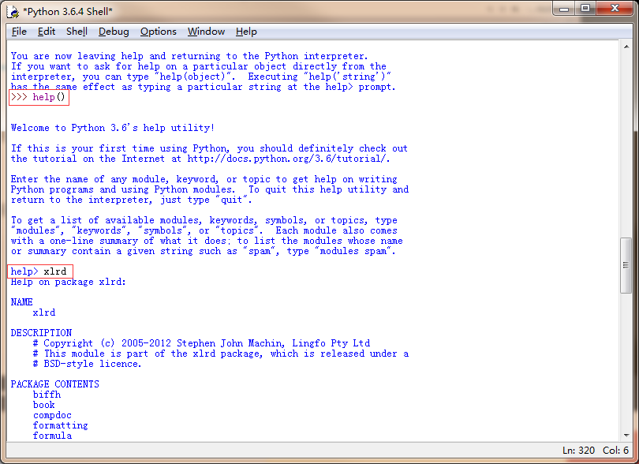

## python学习方法
---

### 了解一个模块的功能
1. help() 输入对应的模块名称
  - 先在cmd窗口中输入 `pip list` 查询系统中有那些模块
  - 在idle编辑器中输入help()进入help提示符
  - 输入想要了解的模块名称，就可以查到为模块的相关信息
  

2. 通过网络资源了解模块信息
3. 查看模块源码了解模块信息

### python命令规范
1.class命名为骆驼命令法，如：class UserInfo(Object)
2.包命名为字母全部小写,如：aiomysql
2.函命名为字母全部小写，不同单词以下划线分隔,如：def server_error
